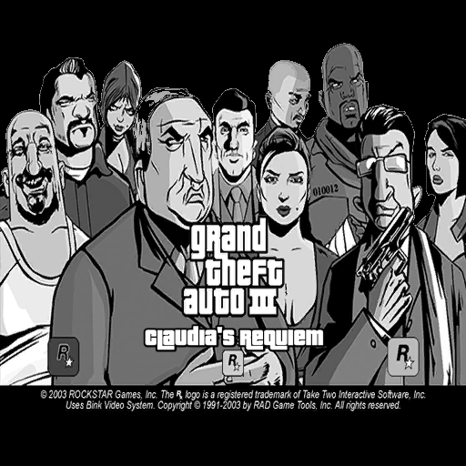

# Grand Theft Auto III: Claudia's Requiem
An alternate story for Grand Theft Auto III on the Microsoft Xbox. Now Grand Theft Auto III is a story about lesbian love and betrayal.

## Features:
- Designed specifically for the Xbox!
- Replaces Claude with "Claudia", a genderswapped version of Claude.
- Replaces the heads up display with a Liberty City Stories style HUD
- Replaces the beeper with a modified version of the Vice City Stories beeper.
- Modifies certain voice lines, subtitles and images to replace all references of Claude with Claudia
- Replaces menu assets with new images showing off the new protagonist!

## Installation:
- Replace the contents of your "TXD" folder in GTA III with the contents in the "TXD" folder from Claudia's Requiem
- Replace the contents of your "TEXT" folder in GTA III with the contents in the "TEXT" folder from Claudia's Requiem
- Use ImgTool 2.0 to replace (or delete then re-add) model files with the ones found in the "models" folder from Claudia's Requiem
